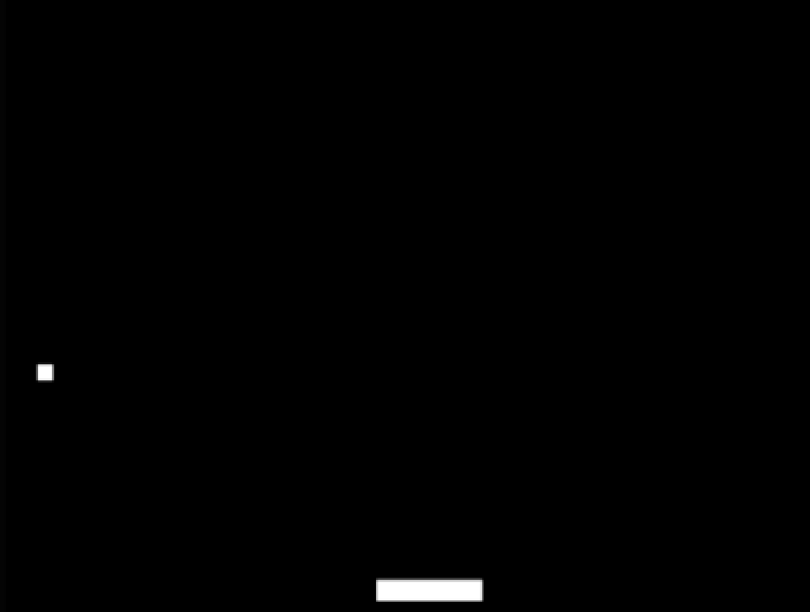

[](https://classroom.github.com/a/XglgMq0o)
# Documentación del Proyecto
---
Estudiante:  Tomas Mejia
Id:  466315
---
### 1. ¿Cuál es la diferencia entre un programa y un proceso?
Un programa es solo un archivo con instrucciones (como un archivo .exe).
Un proceso es cuando el programa está corriendo en la computadora, usando memoria y CPU.
### 2. ¿Puedo tener múltiples procesos corriendo el mismo programa?
Sí, puedes tener muchos procesos ejecutando el mismo programa al mismo tiempo. Ejemplo: abrir varias ventanas del navegador.

### 3. ¿Para qué sirve el stack de un proceso?
El stack (pila) guarda:

Variables temporales y datos de funciones.
Direcciones para volver al punto correcto cuando una función termina.
### 4. ¿Para qué sirve el heap de un proceso?
El heap (montículo) es para guardar datos que necesitas en el programa por más tiempo y que pueden cambiar de tamaño. Usas funciones como malloc() para pedir memoria y free() para liberarla.

### 5. ¿Qué es la zona de texto de un proceso?
Es donde se guarda el código que ejecuta tu programa (las instrucciones). Está protegido para que no se modifique mientras el programa corre.

### 6. ¿Dónde se almacenan las variables globales inicializadas?
Las variables globales que tienen un valor asignado desde el inicio se guardan en la sección de datos.

### 7. ¿Dónde se almacenan las variables globales no inicializadas?
Las variables globales que no tienen un valor asignado al inicio se guardan en la sección BSS y se inicializan a cero automáticamente.

### 8. ¿Cuáles son los posibles estados de un proceso en general?
Los estados comunes de un proceso son:

- Nuevo: Se está creando.
- Listo: Esperando su turno para usar la CPU.
- Ejecutando: Usando la CPU.
- Bloqueado: Esperando algo (como entrada/salida).
- Terminado: Ha terminado y está listo para ser eliminado.

### Ejercicio 4: creación de hilos
 programa tiene dos hilos:

- Hilo principal (en main):

- Imprime la letra "o" continuamente en un bucle infinito.
Hilo secundario (creado con pthread_create):

Ejecuta la función imprime_x, que imprime la letra "x" continuamente en un bucle infinito.

¿Qué ocurre al ejecutar el programa?

Ambos hilos imprimen al mismo tiempo, por lo que en la terminal verás una mezcla de "o" y "x"
### Ejercicio 5: análisis de código con hilos
El problema es que el programa termina antes de que los hilos puedan imprimir nada porque exit() se ejecuta de inmediato.


Usa pthread_join() para que el programa espere a que los hilos terminen antes de salir:

### Ejercicio 6: esperar un hilo
Debes usar pthread_join(), que bloquea el hilo principal hasta que el hilo especificado termine su ejecución. En el código anterior, se utiliza correctamente:
```c
pthread_join(threadID1, NULL);  // Espera a que threadID1 termine
pthread_join(threadID2, NULL);  // Espera a que threadID2 termine
```
El hilo principal espera que el primer hilo termine antes de crear y esperar al segundo hilo.
Secuencial: El hilo principal no inicia el segundo hilo hasta que el primero ha terminado.
Segundo fragmento:

```c
pthread_create(&threadID1, NULL, &imprime, &threadParam1);
pthread_create(&threadID2, NULL, &imprime, &threadParam2);
pthread_join(threadID1, NULL);
pthread_join(threadID2, NULL);
```
Ambos hilos se crean al mismo tiempo, y luego el hilo principal espera a que ambos terminen.
Paralelo: Los hilos pueden ejecutarse simultáneamente.
Esto garantiza que los hilos impriman 'a' y 'b' en la terminal antes de que el programa termine.
lo que se puede relsatar es que en el primer fragmento, los hilos son ejecutados de manera secuencial
### Ejercicio 7: para pensar
Para trabajar con hilos en SDL2, la biblioteca proporciona funciones específicas para crear y manejar hilos, como SDL_CreateThread(), que es similar a los hilos en otras bibliotecas, pero con un enfoque adaptado al ecosistema SDL2.

Creación de hilos con SDL2
En SDL2, un hilo se crea utilizando SDL_CreateThread(). Esta función toma como parámetros el nombre de la función que ejecutará el hilo y un puntero a los datos que se pasarán a esa función. La función para el hilo debe devolver un int, que es el código de salida del hilo. Aquí tienes un ejemplo básico de cómo crear un hilo:
#include <SDL.h>
#include <stdio.h>
```c
int SDL_ThreadFunction(void* data) {
    printf("¡Hilo en ejecución!\n");
    return 0;
}

int main() {
    SDL_Thread* thread = SDL_CreateThread(SDL_ThreadFunction, "MiHilo", NULL);
    
    if (thread == NULL) {
        printf("Error al crear el hilo: %s\n", SDL_GetError());
        return 1;
    }

    SDL_WaitThread(thread, NULL);  // Esperar a que el hilo termine
    return 0;
}
```
En este código, SDL_CreateThread() crea un nuevo hilo que ejecuta SDL_ThreadFunction, y SDL_WaitThread() espera a que termine antes de continuar con el hilo principal

Equivalente de join en SDL2
En SDL2, el equivalente de join en otras bibliotecas de hilos es SDL_WaitThread(). Esta función bloquea el hilo principal hasta que el hilo especificado haya terminado su ejecución​
Semáforos en SDL2
Los semáforos en SDL2 se usan para la sincronización entre hilos, ayudando a evitar condiciones de carrera. Una condición de carrera ocurre cuando dos hilos acceden simultáneamente a un recurso compartido, lo que puede resultar en comportamientos indeseados debido a la falta de sincronización.

Ejemplo de uso de un semáforo
Puedes usar SDL_SemWait() para bloquear el semáforo y SDL_SemPost() para liberar el semáforo. Esto garantiza que solo un hilo acceda a un recurso compartido a la vez. A continuación, un ejemplo básico para evitar una condición de carrera:
```c
#include <SDL.h>
#include <stdio.h>

SDL_sem* sem;

int contador = 0;

int hilo(void* data) {
    SDL_SemWait(sem);  // Espera el semáforo
    for (int i = 0; i < 10; i++) {
        contador++;
        SDL_Delay(10);  // Simula trabajo
    }
    SDL_SemPost(sem);  // Libera el semáforo
    return 0;
}

int main() {
    sem = SDL_CreateSemaphore(1);  // Crea un semáforo con un valor inicial de 1 (solo un hilo puede acceder)

    SDL_Thread* t1 = SDL_CreateThread(hilo, "Hilo1", NULL);
    SDL_Thread* t2 = SDL_CreateThread(hilo, "Hilo2", NULL);

    SDL_WaitThread(t1, NULL);
    SDL_WaitThread(t2, NULL);

    printf("Valor final del contador: %d\n", contador);

    SDL_DestroySemaphore(sem);  // Libera el semáforo
    return 0;
}

```
Este ejemplo crea un semáforo que se asegura de que solo un hilo pueda modificar el contador a la vez, evitando así una condición de carrera. Si no se utilizara el semáforo, ambos hilos podrían intentar modificar el contador simultáneamente, lo que causaría un resultado inconsistente.
### Ejercicio 8: ejemplo de referencia para la evaluación



Para que el programa reproduzca el sonido, el usuario debe presionar la tecla P. Esto ocurre dentro de la función process_input(), donde se captura el evento de pulsación de tecla y si la tecla presionada es SDLK_p, se llama a la función play_audio().

Análisis del código para reproducir el sonido:
Reproducción del audio:

En la función play_audio(), se inicializa el dispositivo de audio (con SDL_OpenAudioDevice()), y se configura el formato del audio y la función de callback AudioCallback(), que se encarga de manejar el flujo de audio.
La función AudioCallback() copia los datos de audio desde el buffer cargado (audioContext.audioData) hacia el stream de audio cada vez que SDL la invoca.
El sonido se reproduce cuando se llama a SDL_PauseAudioDevice(audioDevice, 0).
Sincronización:

El problema ocurre porque, mientras se reproduce el sonido, el programa sigue ejecutando el juego. Esto puede generar un desorden o interrupciones en el flujo del programa debido a la falta de una sincronización adecuada entre los eventos de audio y el juego.
Problema identificado:
El principal problema es la sincronización entre la reproducción del audio y la ejecución del juego. Debido a que play_audio() se ejecuta de manera asíncrona, el código del juego sigue ejecutándose mientras el sonido se reproduce, lo que puede causar problemas si se intenta reproducir un sonido mientras otro ya está en reproducción.

Solución propuesta con semáforos:
Objetivo: Sincronizar la reproducción del sonido con la ejecución del juego, garantizando que solo se reproduzca un sonido a la vez y que el juego pueda esperar a que termine antes de continuar con otras acciones.

Pasos para implementar la solución:

- Crear un semáforo: El semáforo se utilizará para sincronizar el hilo de la reproducción de audio con el hilo principal del juego.
```c
SDL_Semaphore* audioSemaphore = NULL;
```
- nicializar el semáforo: El semáforo se inicializa antes de que se reproduzca cualquier sonido, para asegurarse de que haya un control sobre el acceso al hilo de audio.
```c
audioSemaphore = SDL_CreateSemaphore(1); 
```
- Uso del semáforo en la reproducción del audio:

Antes de reproducir cualquier sonido, se debe tomar el semáforo para asegurarse de que no haya otro audio reproduciéndose.
Cuando el audio termine de reproducirse, se libera el semáforo para permitir la reproducción de un nuevo sonido.
Modificar la función play_audio():
```c
void play_audio(void) {
    static uint8_t isaudioDeviceInit = 0;
    static SDL_AudioSpec audioSpec;
    static SDL_AudioDeviceID audioDevice = 0;
    static AudioContext audioContext;

    // Inicializar dispositivo de audio solo una vez
    if (isaudioDeviceInit == 0) {
        audioSpec.callback = AudioCallback;
        audioSpec.userdata = &audioContext;

        audioDevice = SDL_OpenAudioDevice(NULL, 0, &audioSpec, NULL, 0);
        if (audioDevice == 0) {
            printf("Unable to open audio device: %s\n", SDL_GetError());
            return;
        }
        isaudioDeviceInit = 1;
    }

    // Tomar semáforo para asegurarse de que no haya un audio en ejecución
    SDL_SemWait(audioSemaphore);

    audioContext.audioPosition = 0;
    audioContext.audioFinished = SDL_FALSE;

    // Cargar archivo WAV
    if (SDL_LoadWAV("tap.wav", &audioSpec, &audioContext.audioData, &audioContext.audioLength) != NULL) {
        SDL_PauseAudioDevice(audioDevice, 0); // Comienza a reproducir audio
    } else {
        printf("Unable to load WAV file: %s\n", SDL_GetError());
        SDL_SemPost(audioSemaphore);  // Liberar semáforo en caso de error
        return;
    }

    // Esperar hasta que termine la reproducción del audio
    while (audioContext.audioFinished != SDL_TRUE) {
        SDL_Delay(100);
    }

    printf("Audio finished\n");

    // Liberar semáforo cuando el audio termine
    SDL_SemPost(audioSemaphore);

    // Limpiar
    SDL_CloseAudio(audioDevice);
    SDL_FreeWAV(audioContext.audioData);
}
```
ya como en conclucion 
Sincronización con SDL_SemWait y SDL_SemPost:

SDL_SemWait(audioSemaphore) es como una especie de "candado" que asegura que no se reproduzcan dos sonidos al mismo tiempo. Si ya hay un sonido sonando (el semáforo está bloqueado), el juego tiene que esperar hasta que termine para poder reproducir otro.
Una vez que el sonido termina, SDL_SemPost(audioSemaphore) "libera el candado", permitiendo que el juego reproduzca otro sonido si es necesario.
Ventajas:

Evita que se escuchen sonidos mezclados, lo que puede causar un caos o ruidos extraños.
Hace que el juego espere de manera ordenada a que termine el sonido antes de seguir con otras cosas.
Conclusión: Usar un semáforo aquí ayuda a que el sonido y el juego trabajen bien juntos, evitando que se "interrumpan" y asegurando que no haya problemas con varios sonidos sonando a la vez.

### Ejercicio 9
En este ejemplo, usamos una variable global (shared) para que dos hilos puedan modificarla. Cada hilo simplemente aumenta en 1 el valor de shared. En el código, primero se crean dos hilos con pthread_create, que ejecutan la función que incrementa el valor de la variable. Luego, con pthread_join, esperamos a que ambos hilos terminen antes de mostrar el valor de shared.

Lo interesante es que siempre que corremos el código, el valor final de shared es 2, sin importar cuántas veces lo ejecutemos, lo que demuestra que no hay condiciones de carrera y los hilos se alternan correctamente al acceder al recurso compartido.

### Ejercicio 10
Cuando agregamos un bucle que hace que cada hilo incremente la variable shared varias veces (por ejemplo, 100 veces), hay más oportunidades para que los hilos interfieran entre sí. Si ambos hilos intentan modificar shared al mismo tiempo, podrían sobrescribir los cambios de uno u otro, lo que provoca errores. Esto es una condición de carrera.

Al aumentar el número de iteraciones, los errores se hacen más evidentes. Por ejemplo, si ambos hilos incrementan shared 100 veces cada uno, lo esperado sería que shared llegara a 200, pero en realidad podría quedar con un valor incorrecto porque los incrementos no se manejan de forma sincronizada.

La solución sería usar un mutex para asegurarse de que solo un hilo pueda modificar la variable a la vez.

### Ejercicio 11
Este programa utiliza un mutex para asegurarse de que dos hilos no modifiquen la variable shared al mismo tiempo. Sin el mutex, los hilos podrían intentar incrementar la variable a la vez, lo que generaría un valor incorrecto.

En este código, ambos hilos ejecutan la función function, que incrementa shared en 100 iteraciones. El mutex bloquea el acceso a la variable para que solo un hilo la modifique a la vez. Al final, el valor de shared será 200, porque los hilos se sincronizan correctamente.

En resumen, el mutex asegura que no haya problemas de concurrencia entre los hilos.

### Ejercicio 12
Los semáforos son herramientas para controlar el acceso a recursos compartidos entre hilos, evitando que varios hilos accedan al mismo recurso al mismo tiempo. Se usan de la siguiente manera:

Inicialización: Se inicia con un valor que indica cuántos hilos pueden acceder al recurso. Por ejemplo, 1 significa que solo un hilo puede acceder a la vez.

Bloqueo: Un hilo usa sem_wait() para esperar hasta que el semáforo esté disponible (es decir, hasta que el recurso esté libre).

Liberación: Cuando el hilo termina de usar el recurso, llama a sem_post() para liberar el semáforo, permitiendo que otro hilo lo use.

El uso adecuado de semáforos evita que los hilos interfieran entre sí y previene errores como las condiciones de carrera, donde dos hilos modifican un recurso al mismo tiempo. Sin embargo, hay que usarlos con cuidado para no generar bloqueos (deadlocks).

# Evaluación Unidad 4
## Documentacion 

utiliza semáforos (en forma de mutex) para sincronizar el acceso al recurso compartido de audio entre el hilo principal y el hilo de audio


aqui ya se agrega el sonido de incioi del juego 


se agrega el sonido del movimeinto de player 


un sonido cunaod player toca a circle y genera un sonido el cual señala que perdiste 


aquie agregue un power up que es un triangulo que aumenta la velocidad del juegador y genera  un sonido cunado el jugador lo toca 


se agrega un sonido que es cunaod el jugador choca con los limites de la pantalla 


```c
#include <SDL.h>
#include <stdio.h>
#include <stdlib.h>
#include <stdbool.h>
#include <time.h>

#define WINDOW_WIDTH 800
#define WINDOW_HEIGHT 600
#define MAX_CIRCLES 25

typedef struct {
    int x, y;
    int radius;
    int vel_y;
    bool active;
} Circle;

typedef struct {
    int x, y;
    int width, height;
    int vel_x;
} Player;

typedef struct {
    int x, y;
    int size;
    int vel_y;
    bool active;
} Triangle;

bool game_over = false;
Player player;
Circle circles[MAX_CIRCLES];
Triangle triangle;
int active_circles = 1;
Uint32 last_add_time = 0;
Uint32 speed_boost_end_time = 0;
bool speed_boost_active = false;

SDL_mutex* mutex_audio;
SDL_Thread* audio_thread;

SDL_AudioDeviceID device_id;
SDL_AudioSpec wav_spec;
Uint8* wav_buffer;
Uint32 wav_length;

void initialize_player(Player* player) {
    player->x = WINDOW_WIDTH / 2;
    player->y = WINDOW_HEIGHT - 50;
    player->width = 40;
    player->height = 40;
    player->vel_x = 0;
}

void initialize_circle(Circle* circle) {
    circle->x = rand() % (WINDOW_WIDTH - circle->radius * 2) + circle->radius;
    circle->y = 0;
    circle->vel_y = 4 + rand() % 3;
    circle->radius = 20 + rand() % 30;
    circle->active = true;
}

void initialize_triangle(Triangle* triangle) {
    triangle->x = rand() % (WINDOW_WIDTH - 30) + 15;
    triangle->y = 0;
    triangle->size = 30;
    triangle->vel_y = 3;
    triangle->active = true;
}

void draw_circle(SDL_Renderer* renderer, int center_x, int center_y, int radius) {
    for (int w = 0; w < radius * 2; w++) {
        for (int h = 0; h < radius * 2; h++) {
            int dx = radius - w;
            int dy = radius - h;
            if ((dx * dx + dy * dy) <= (radius * radius)) {
                SDL_RenderDrawPoint(renderer, center_x + dx, center_y + dy);
            }
        }
    }
}

void draw_triangle(SDL_Renderer* renderer, Triangle* triangle) {
    SDL_SetRenderDrawColor(renderer, 0, 255, 0, 255);
    SDL_Point points[4] = {
        {triangle->x, triangle->y},
        {triangle->x - triangle->size / 2, triangle->y + triangle->size},
        {triangle->x + triangle->size / 2, triangle->y + triangle->size},
        {triangle->x, triangle->y}
    };
    SDL_RenderDrawLines(renderer, points, 4);
}

bool detect_collision(Player* player, Circle* circle) {
    int dist_x = player->x + player->width / 2 - circle->x;
    int dist_y = player->y + player->height / 2 - circle->y;
    int distance = dist_x * dist_x + dist_y * dist_y;
    int radius_squared = circle->radius * circle->radius;

    return distance < radius_squared;
}

bool detect_collision_triangle(Player* player, Triangle* triangle) {
    return (player->x < triangle->x + triangle->size / 2 &&
        player->x + player->width > triangle->x - triangle->size / 2 &&
        player->y < triangle->y + triangle->size &&
        player->y + player->height > triangle->y);
}

void increase_difficulty(Uint32 current_time) {
    if ((current_time - last_add_time) > 5000 && active_circles < MAX_CIRCLES) {
        initialize_circle(&circles[active_circles]);
        active_circles++;
        last_add_time = current_time;
    }
}

void audio_callback(void* data) {
    while (!game_over) {
        SDL_LockMutex(mutex_audio);

        if (game_over) break;

        SDL_QueueAudio(device_id, wav_buffer, wav_length);
        SDL_PauseAudioDevice(device_id, 0);

        SDL_UnlockMutex(mutex_audio);
    }
}

void play_sound(const char* sound_path) {
    if (SDL_LoadWAV(sound_path, &wav_spec, &wav_buffer, &wav_length) == NULL) {
        printf("Error loading WAV: %s\n", SDL_GetError());
        return;
    }

    SDL_LockMutex(mutex_audio);

    SDL_QueueAudio(device_id, wav_buffer, wav_length);
    SDL_PauseAudioDevice(device_id, 0);

    SDL_UnlockMutex(mutex_audio); 
}

void play_collision_sound() {
    play_sound("collision_sound.wav");
}

int main(int argc, char* args[]) {
    if (SDL_Init(SDL_INIT_VIDEO | SDL_INIT_AUDIO) != 0) {
        fprintf(stderr, "Error al inicializar SDL: %s\n", SDL_GetError());
        return 1;
    }

    SDL_AudioSpec desired_spec;
    desired_spec.freq = 44100;
    desired_spec.format = AUDIO_S16SYS;
    desired_spec.channels = 2;
    desired_spec.samples = 4096;
    desired_spec.callback = NULL;

    device_id = SDL_OpenAudioDevice(NULL, 0, &desired_spec, &wav_spec, SDL_AUDIO_ALLOW_ANY_CHANGE);

    if (device_id == 0) {
        fprintf(stderr, "Error opening audio device: %s\n", SDL_GetError());
        return 1;
    }

    mutex_audio = SDL_CreateMutex();

    audio_thread = SDL_CreateThread(audio_callback, "AudioThread", NULL);

    SDL_Window* window = SDL_CreateWindow("Juego de esquivar", SDL_WINDOWPOS_CENTERED, SDL_WINDOWPOS_CENTERED, WINDOW_WIDTH, WINDOW_HEIGHT, 0);
    SDL_Renderer* renderer = SDL_CreateRenderer(window, -1, SDL_RENDERER_ACCELERATED);

    srand(time(0));
    initialize_player(&player);
    initialize_circle(&circles[0]);
    initialize_triangle(&triangle);

    last_add_time = SDL_GetTicks();
    bool game_running = true;
    SDL_Event event;

    play_sound("start_sound.wav");

    while (game_running && !game_over) {
        while (SDL_PollEvent(&event)) {
            if (event.type == SDL_QUIT) {
                game_running = false;
            }
            else if (event.type == SDL_KEYDOWN) {
                if (event.key.keysym.sym == SDLK_a || event.key.keysym.sym == SDLK_d) {
                    play_sound("move_sound.wav");
                }
                if (event.key.keysym.sym == SDLK_a) player.vel_x = speed_boost_active ? -10 : -5;
                else if (event.key.keysym.sym == SDLK_d) player.vel_x = speed_boost_active ? 10 : 5;
            }
            else if (event.type == SDL_KEYUP) {
                if (event.key.keysym.sym == SDLK_a || event.key.keysym.sym == SDLK_d) player.vel_x = 0;
            }
        }

        player.x += player.vel_x;

        if (player.x < 0) {
            player.x = 0;
            play_collision_sound(); 
        }
        if (player.x + player.width > WINDOW_WIDTH) {
            player.x = WINDOW_WIDTH - player.width;
            play_collision_sound(); 
        }

        for (int i = 0; i < active_circles; i++) {
            if (circles[i].active) {
                circles[i].y += circles[i].vel_y;
                if (circles[i].y - circles[i].radius > WINDOW_HEIGHT) initialize_circle(&circles[i]);
                if (detect_collision(&player, &circles[i])) {
                    game_over = true;
                    play_sound("lose_sound.wav"); 
                }
            }
        }

        triangle.y += triangle.vel_y;
        if (triangle.y > WINDOW_HEIGHT) initialize_triangle(&triangle);
        if (detect_collision_triangle(&player, &triangle)) {
            speed_boost_active = true;
            speed_boost_end_time = SDL_GetTicks() + 5000; 
            play_sound("speed_boost_sound.wav"); 
        }

        if (speed_boost_active && SDL_GetTicks() > speed_boost_end_time) {
            speed_boost_active = false;
        }

        Uint32 current_time = SDL_GetTicks();
        increase_difficulty(current_time);

        SDL_SetRenderDrawColor(renderer, 0, 0, 0, 255);
        SDL_RenderClear(renderer);

        // Draw everything
        SDL_SetRenderDrawColor(renderer, 255, 0, 0, 255);
        SDL_Rect player_rect = { player.x, player.y, player.width, player.height };
        SDL_RenderFillRect(renderer, &player_rect);

        for (int i = 0; i < active_circles; i++) {
            if (circles[i].active) {
                draw_circle(renderer, circles[i].x, circles[i].y, circles[i].radius);
            }
        }

        draw_triangle(renderer, &triangle);

        SDL_RenderPresent(renderer);

        SDL_Delay(16);
    }

    SDL_DestroyRenderer(renderer);
    SDL_DestroyWindow(window);

    SDL_CloseAudioDevice(device_id);
    SDL_Quit();

    return 0;
}

```
## Hilos 
se utilizan hilos y mutexes para manejar la sincronización y la ejecución concurrente de tareas. El uso de hilos en este caso se centra en la reproducción de audio, mientras que las otras tareas del juego, como la lógica del movimiento de los objetos y la detección de colisiones, se realizan de forma secuencial en el hilo principal.

Hilos en la Aplicación
1. Hilo de Audio:
El hilo de audio es creado con la función SDL_CreateThread, que se ejecuta en paralelo al hilo principal. Este hilo se encarga de gestionar la reproducción de audio durante el juego, asegurándose de que los sonidos se reproduzcan sin bloquear el hilo principal, lo que permite que el juego siga funcionando de manera fluida.

Función: La función audio_callback es la que se ejecuta en el hilo de audio. Esta función entra en un bucle donde verifica constantemente si el juego ha terminado (a través de la variable global game_over). Mientras el juego esté en ejecución, se encarga de reproducir los sonidos utilizando SDL_QueueAudio y SDL_PauseAudioDevice.
Sincronización con el hilo principal: El hilo de audio está sincronizado con el hilo principal mediante el uso de un mutex (un mecanismo de sincronización) para controlar el acceso a los recursos compartidos, en este caso, la reproducción de audio.
2. Hilo Principal:
El hilo principal gestiona la lógica del juego, que incluye el manejo de eventos, el movimiento de objetos, la detección de colisiones y el renderizado. En particular:

Eventos: Captura los eventos del teclado para mover al jugador o realizar otras interacciones.
Lógica de juego: Actualiza las posiciones de los objetos en el juego (jugador, círculos y triángulo), comprueba las colisiones, incrementa la dificultad y controla el estado del juego (si el jugador ha perdido o si el juego sigue corriendo).
Renderizado: Dibuja todos los objetos en la pantalla en cada fotograma y actualiza la visualización.
Sincronización de Hilos mediante Mutex
Para evitar que el acceso a recursos compartidos (en este caso, la reproducción de audio) cause problemas de concurrencia, se utiliza un mutex (mutex_audio). Este mutex asegura que solo un hilo pueda acceder a la cola de audio a la vez.

Cómo funciona la sincronización:
Bloqueo del mutex:

En la función play_sound, el hilo principal solicita acceso al mutex antes de reproducir cualquier sonido con SDL_LockMutex(mutex_audio). Esto asegura que el hilo de audio no esté reproduciendo un sonido en ese momento.
Reproducción de audio:

Luego, el sonido se coloca en la cola de audio con SDL_QueueAudio, y se inicia la reproducción con SDL_PauseAudioDevice(device_id, 0).
Desbloqueo del mutex:

Después de que el sonido se ha colocado en la cola y se ha iniciado, el mutex se desbloquea con SDL_UnlockMutex(mutex_audio). Esto permite que el hilo de audio acceda nuevamente al recurso y continúe reproduciendo otros sonidos.
De esta manera, se evita que los hilos accedan simultáneamente a los recursos de audio, lo que podría generar inconsistencias o colisiones de audio. El mutex actúa como un "candado" para garantizar que solo un hilo pueda realizar operaciones en el recurso compartido a la vez.

Por qué es necesario el uso de hilos y mutexes:
En aplicaciones de videojuegos, especialmente aquellas que manejan audio y gráficos, es común que el hilo principal de juego se vea bloqueado por tareas como la reproducción de sonidos o la carga de archivos. Si no se gestionaran adecuadamente, estas tareas bloquearían la ejecución del juego, causando una experiencia de usuario pobre. Al delegar la reproducción de audio a un hilo separado, se asegura que el juego continúe sin interrupciones.

Resumen:
El hilo principal gestiona la lógica del juego y el renderizado.
El hilo de audio maneja la reproducción de sonidos en segundo plano.
Se utilizan mutexes (mutex_audio) para sincronizar el acceso a los recursos de audio, garantizando que no haya interferencias entre el hilo principal y el hilo de audio.
Este enfoque permite una experiencia de usuario más fluida, evitando bloqueos y permitiendo que el juego y el audio se gestionen de forma concurrente.
